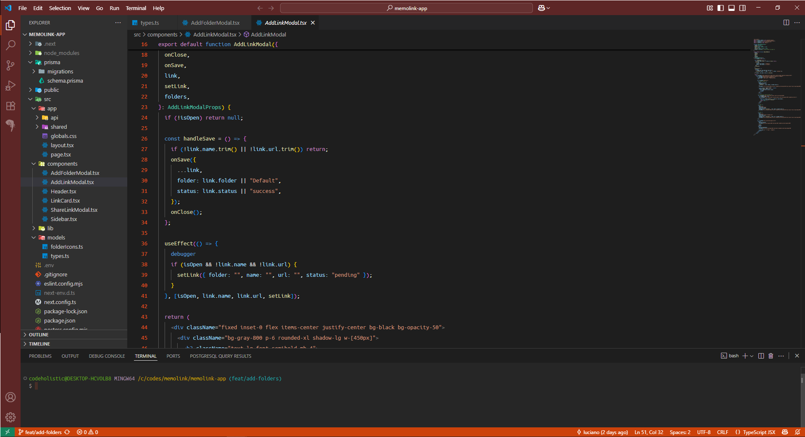

<h1 align="center">
  
  <br/>
  Canonic Theme
</h1> 

Tema baseado no estilo visual da [Canonical](https://canonical.com) e nas cores do **Ubuntu**, com cores elegantes e contraste suave.  
Criado para quem gosta de foco, minimalismo e legibilidade no código.  

---

## 👨‍💻 Autor

Criado por **[lucodifier](https://github.com/lucodifier)**  
Tema baseado no estilo visual da [Canonical](https://canonical.com) e nas cores do **Ubuntu**.

---

## ✨ Preview



---

## 🚀 Instalação

1. Baixe e instale o `.vsix`:
   ```bash
   vsce package
   code --install-extension canonic-theme-0.0.1.vsix```

2. Ative o tema:

Ctrl+Shift+P → Color Theme → Canonic Theme

📝 Recomendações de Fonte

Para a melhor experiência, adicione ao seu settings.json:

```json
{
  "editor.fontFamily": "'Ubuntu Variable', 'Ubuntu Mono', 'JetBrains Mono', monospace",
  "editor.fontLigatures": true,
  "editor.fontSize": 14,
  "editor.lineHeight": 22
}```